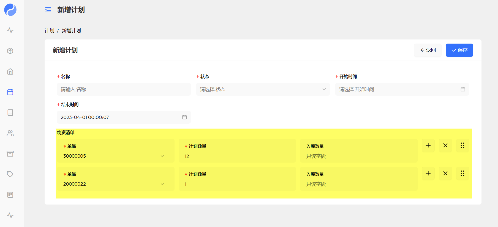

# 在 Form 里嵌套 List 控件

## `List`控件与`Table`控件的区别

- `List`是一个纯前端的组件，数据来源于`value`属性,可以直接使用`Form`的`withs`关联表的数据，而`Table`的数据来源需要从服务器上读取。
- `List`在`Form`里可进行/新增/删除/修改,而`Table`不能新增数据。

## Step1 定义 List

在`/lists`目录下新增一个`List`类型的定义，文件名格式是`plan_item.list.json`。

`LIST DSL`在结构上大致与`Table`一样。需要配置`fields.list`,`layout.list.columns`

```json
{
  "action": {
    "bind": {
      "model": "plan.item"
    }
  },
  "layout": {
    "list": {
      "columns": [
        { "name": "单品", "width": 8 },
        { "name": "计划数量", "width": 8 },
        { "name": "入库数量", "width": 8 }
      ]
    }
  },
  "fields": {
    "list": {
      "id": {
        "bind": "id",
        "edit": {
          "props": { "placeholder": "请输入 ID" },
          "type": "InputNumber"
        },
        "view": { "props": {}, "type": "Text" }
      },
      "单品": {
        "bind": "sku_id",
        "edit": {
          "props": {
            "itemProps": {
              "rules": [{ "required": true }]
            },
            "xProps": {
              "$remote": {
                "process": "yao.component.SelectOptions",
                "query": {
                  "model": "material.sku",
                  "label": "sku_sn",
                  "value": "id"
                }
              }
            }
          },
          "type": "Select"
        }
      },
      "入库数量": {
        "bind": "amount",
        "edit": {
          "props": {
            "placeholder": "只读字段",
            "disabled": true
          },
          "type": "InputNumber"
        },
        "view": { "props": {}, "type": "Text" }
      },
      "计划数量": {
        "bind": "amount_plan",
        "edit": {
          "props": {
            "itemProps": {
              "rules": [{ "required": true }]
            },
            "min": 0
          },
          "type": "InputNumber"
        },
        "view": { "props": {}, "type": "Text" }
      }
    }
  }
}
```

## Step2 Form 配置

在`Form`的配置文件中加一个字段配置。

字段的编辑控件的类型需要设置为`List`。

编辑属性里需要把`name`设置成上面配置`list`的名称。

字段绑定的字段的类型需要是`json`,比如这里绑定的字段`items`的类型需要是一个`json list`。

可选配置`"showLabel": true`,`List`控件里的字段显示标签

```jsonc
{
  "fields": {
    "form": {
      "物资清单": {
        "bind": "items",
        "edit": {
          "type": "List",
          "props": {
            "name": "plan_item", //重要
            "showLabel": true
          }
        }
      }
    }
  }
}
```

完成以上的操作，就可以在 Form 看到一个列表控件。控件中的行项目可以拖动调整顺序。



## Step3 保存数据。

你可能会遇到这个问题

[List 删除项目后，列表被清空](../../%E6%BA%90%E4%BB%A3%E7%A0%81/Xgen/xgen%20List%E6%8E%A7%E4%BB%B6%E4%BF%9D%E5%AD%98%E6%95%B0%E6%8D%AE%E6%97%B6%E6%95%B0%E6%8D%AE%E8%A2%AB%E6%B8%85%E7%A9%BA.md)

`List`控件的数据保存操作需要在`Form`的`Hook`里进行拦截处理。

在`Form`里使用`save`事件的`Hook`

`/yao-wms/forms/plan.form.json`

```json
{
  "name": "计划",
  "action": {
    "bind": {
      "model": "plan",
      "option": {
        "withs": {
          "items": {}
        }
      }
    },
    "save": {
      "process": "scripts.plan.Save" //保存在这里
    },
    "before:delete": "scripts.plan.BeforeDeletePlan" //删除在这里
  }
}
```

处理脚本：`/yao-wms/scripts/plan.js`，详细逻辑请查注释。

如果是`Form`与`List`控件的数据是主从表关系，需要考虑联动删除与保存逻辑。

```js
/**自定义保存数据函数 */
function Save(data) {
  //先保存主表，获取id后再保存从表
  var id = Process('models.plan.Save', data);
  AfterSave(id, data);
}

/**
 * 更新 Items
 */
function AfterSave(id, payload) {
  var items = payload.items || {};
  var deletes = items.delete || [];
  //当有删除项目时,数据保存在items.data里
  //如果没有删除项目,项目items
  var data = items.data || items || [];

  if (data.length > 0 || deletes.length > 0) {
    // 忽略实际数据 ( 通过 record 计算获取)
    for (var i in data) {
      delete data[i].amount;
      if (typeof data[i].id === 'string' && data[i].id.startsWith('_')) {
        //新增项目，在前端会生成唯一字符串,
        //由于后台使用的自增长ID，不需要生成的唯一字符串，由数据库生成索引
        delete data[i].id;
      }
    }

    // 保存物品清单
    var res = Process('models.plan.item.EachSaveAfterDelete', deletes, data, {
      plan_id: id,
    });
    if (res.code && res.code > 300) {
      console.log('Plan:AfterSave Error:', res);
      return id;
    }
  }

  // 生成计划标签
  var plan_sn = payload['plan_sn'];
  if (!plan_sn) {
    return Process('models.plan.Save', { id: id, plan_sn: MakeSN(id) });
  }

  return id;
}

/**
 * 生成计划标签 (1+id)
 * 标签: 类目(6)-SKU(8)-**计划(6)**-Item(9)
 *      100001 20000001 000000 400000001
 */
function MakeSN(id) {
  var sn = id.toString();
  return sn.padStart(6, '0');
}
```

### 数据删除

数据的删除需要考虑表格数据批量删除与表单单个删除。

```js
/**
 * 关联表删除
 * before Delete Plan
 * @param {number} id Plan id
 */
function BeforeDeletePlan(id) {
  // console.log("delete Plan with id:", id);
  let rows = Process('models.plan.item.DeleteWhere', {
    wheres: [{ column: 'plan_id', value: id }],
  });

  //remembe to return the id in array format
  return [id];
}

/**
 * 关联表批量删除
 * before Delete Plan Batch
 * @param {array} param0 Plan object
 */
function BeforeDeletePlanIn({ wheres }) {
  let array = wheres[0].value || [];
  array.forEach((element) => {
    BeforeDeletePlan(element);
  });

  return array;
}
```

## 完整的例子

请查看项目源代码:[yao-wms](https://github.com/wwsheng009/yao-wms)
